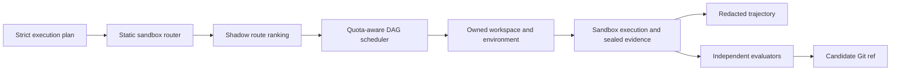

# Sandbox Execution Fabric

Status: experimental foundation for the next sandbox releases. Existing
`ecc-sandbox run` and `review` behavior stays unchanged. The additive
`ecc-sandbox fabric` controller and the modules under `scripts/sandbox/fabric/`
are opt-in.

The [September 8 approved direction](#approved-direction-isolated-software-work)
now has an additive v2 execution-plan and fabric-envelope slice. It records the
execution class, placement, operator, shell-only coverage, excluded surfaces,
enforced and missing controls, evidence limits, and resource monitoring. The
stable v1 sandbox manifest and numeric report remain unchanged.

## Product Goal

The execution fabric turns the three sandbox tiers into a meta-harness substrate.
A harness can fan work out, give every worker a bounded environment, collect one
normalized trajectory, evaluate candidate changes, and promote only a separate
candidate Git ref. It does not apply changes to the caller's branch.

The ordinary ECC user can continue to run one manifest. Advanced harnesses gain
the controls below without widening the sandbox router's authority.

The controller accepts one or more routable targets. Multi-target runs use the
validated scheduler and execute approved routes concurrently up to the bounded
`--max-parallel` value:

```bash
ecc-sandbox fabric sandbox.yaml --plan-only --workspace-mode auto
ecc-sandbox fabric sandbox.yaml --workspace-mode worktree --local-only
ecc-sandbox fabric sandbox.yaml --workspace-mode worktree \
  --candidate-ref refs/heads/ecc/candidates/my-change --local-only
ecc-sandbox fabric sandbox.yaml --workspace-mode isolated-copy --max-parallel 3
```

It emits a strict execution plan, normalized report, public workspace receipt,
sealed patch and evaluation when the workspace is owned, canonical trajectory,
and cleanup receipt. An explicit candidate ref can advance only a separate
`refs/heads/ecc/candidates/*` ref after accepted evaluation and stable-target
checks. It does not apply the patch to the source branch. Multi-target promotion
is intentionally refused because one candidate ref cannot unambiguously
represent several independent job artifacts.

| Capability | V1 behavior | Safety boundary |
| --- | --- | --- |
| Isolated writable workspace | In-place, isolated copy, or trusted linked worktree receipts | Untrusted work cannot use linked worktrees; cleanup requires the owner token |
| Parallel scheduling | Deterministic DAG scheduling with global, per-tier, CPU, memory, and lease limits | Tier 2 defaults to one concurrent guest; dependency failures cancel descendants |
| Warm environments | Digest-bound environment receipts and quarantine-first snapshot metadata | Mutable image, snapshot, and seed references fail closed |
| Unified trajectories | Bounded, redacted, hash-bound command, test, artifact, cost, timing, and cleanup evidence | Passing trajectories require successful work and verified cleanup |
| Credential brokerage | Default-deny, explicit provider and grant, short lease, exact-value redaction | No ambient secrets; Tier 2 exposure requires an explicit grant |
| Evaluator promotion | Binary patch artifact, deterministic evaluators, candidate-ref-only promotion | The worker cannot be its own required evaluator; target changes and dirty checkouts fail closed |
| Adaptive routing | Shadow ranking over routes already admitted by the static router | History never creates a new route or widens trust, network, OS, or capability authority |
| Native visual evidence | Fixed contiguous actions, screenshot hashes, environment identity, and cleanup binding | Exploration output is permanently ineligible as verification evidence |

## Workspace Practice

Worktrees are a useful practice, not a universal Tier 0 requirement.

| Context | Recommended workspace | Reason |
| --- | --- | --- |
| Tier 0 read-only or small trusted probe | In-place | Lowest overhead and existing behavior |
| Tier 0 trusted file-writing worker | Linked worktree | Fast candidate isolation and an exact Git base |
| Tier 0 untrusted worker | Isolated copy | Avoids shared Git administration metadata |
| Tier 1 clean Linux test | Disposable container state with read-only source | The container owns home and package writes; the host checkout stays unchanged |
| Tier 2 native test | Disposable VM state | Source transfer remains an explicit driver concern and must fail closed when unsupported |

A linked worktree shares Git administration metadata outside its directory. SRT
may therefore block Git commands that need that metadata. The harness should
create, inspect, patch, and remove the worktree on the trusted host side while
the sandboxed workload writes only inside the worktree. Use an isolated copy
when the worker is untrusted or when stronger filesystem separation matters.

Candidate output is a sealed patch artifact. Promotion creates a separate
candidate ref only after artifact integrity, sandbox result, cleanup, patch
policy, secret scan, stable target, and evaluator independence checks pass.
Merging that candidate remains an explicit operator or higher-level harness act.

## Meta-Harness Flow



The public execution-plan schema defines jobs, dependencies, workspace modes,
network audiences, and credential requests. The scheduler and event store are
replayable state machines, so a controller can recover from worker loss without
guessing which resources are still owned. Environment, patch, evaluation,
promotion, trajectory, credential, and visual records are strict additive
contracts rather than fields added to the stable sandbox report.

The controller executes the exact route recorded in each plan job and rejects
backend, tier, OS, architecture, or escalation drift before creating an artifact.
One run identifier binds the plan, job artifacts, trajectories, scheduler state,
and outcome. Credential grants remain an explicit broker API in this slice. The
CLI does not infer a provider or inject ambient credentials; a higher-level
harness must register a provider and grant before requesting a scoped lease.
Every job also has a controller-owned deadline derived from its manifest timeout.
Deadline expiry terminates the route worker, cleans its owned workspace, records
lease expiry, and cancels dependent jobs. Strict public workspace, job, and run
schemas validate the final output before the CLI serializes it.

## Test And Release Lanes

The required pull-request lane is host-independent and should stay fast:

- existing router and adapter unit tests;
- all execution-fabric contract and module tests;
- mocked CLI and three-tier orchestration sanity tests;
- schema, syntax, security, and skill validation.

Host-dependent checks belong in explicit integration lanes:

- conditional real Tier 0 SRT and Tier 1 rootless Podman smoke tests;
- nightly or manual Tier 2 Lume tests;
- native visual drivers, warm-cache benchmarks, credential-provider tests, and
  multi-host stress tests;
- a release gate with one representative real pass and verified cleanup for
  every tier claimed by the release.

Mock output proves orchestration only. A release claim must identify real versus
mock execution, evidence completeness, environment identity, and cleanup.

Run the named host lanes from a trusted checkout:

```bash
npm run test:sandbox:host:tier0
npm run test:sandbox:host:tier1
npm run test:sandbox:host:tier2
```

Tier 1 and Tier 2 are conditional by default. They print `BLOCKED` when the
current supported host is missing its runtime prerequisite, or `SKIPPED` when
the host cannot support that tier, then exit successfully without claiming a
real pass. Release gates use the required forms, which return exit code 2 when
the real host smoke cannot run:

```bash
npm run test:sandbox:host:tier1:required
npm run test:sandbox:host:tier2:required
```

Schedule the required Tier 2 command nightly or invoke it manually on a trusted,
dedicated Apple Silicon macOS host with the pinned Lume runtime and stopped
operator-managed seed. Do not place it in the hosted pull-request lane. Tier 1
requires a usable rootless Podman runtime and the pinned ECC Ubuntu image. A
reported `PASS` means the fabric controller produced a real normalized report,
valid plan and trajectory, and verified cleanup. `SKIPPED` and `BLOCKED` never
count as release evidence.

## Shipping Boundary

Ship the contracts, pure modules, focused tests, opt-in scheduled controller,
and skill guidance first.
Keep adaptive routing in shadow mode and credential providers default-deny.
Native visual capture can ship only when a fixed driver produces deterministic
actions and screenshots; visible exploration remains useful but non-evidence.
Tier 1 writable-source export and Tier 2 source transfer should remain explicit
driver capabilities, with fail-closed behavior until their ownership and cleanup
receipts are implemented and tested.

## Approved Direction: Isolated Software Work

Status: approved direction on September 8, 2026. The versioned execution
boundary and controller resource-monitoring slice is implemented in the opt-in
fabric. The first showcase remains an isolated build and verification workflow.
A whole-agent environment follows only after its broader containment and
evidence contracts pass. This section creates no additional task,
orchestration, or policy authority.

### Execution Class And Placement

The v2 execution plan describes the execution boundary separately from where it
runs. These are controller-derived claims, not accepted manifest keys. A v1
plan remains valid without them; every newly emitted v2 plan and fabric job must
carry the strict `execution` object.

| Execution class | Intended work | Required claim |
| --- | --- | --- |
| Restricted process | Focused analysis, compiler checks, and bounded trusted edits | Exact filesystem, process, tool, and network restrictions around host state |
| Disposable container | Linux builds, dependency installation, task-local databases and web services, and headless browser checks | Isolated writable task state, declared inputs and egress, owned service lifecycle, and bounded export |
| Disposable VM | Native service-manager behavior, OS integration, desktop interaction, and workloads requiring a separate kernel | Guest identity, actual containment, native readiness, resource ownership, and verified teardown |

Local, self-hosted, and hosted execution are placement choices. A hosted worker
can use a process, container, or VM boundary; being hosted alone supplies no
stronger security claim. Each route must identify its operator, execution
class, enforced controls, missing controls, and evidence limits.

Preserve the existing numeric report contract: Tier 0 is SRT, Tier 1 is rootless
Podman, Tier 2 is the supported native VM route, and terminal hosted CI remains
`tier: 3`. Current `ci-native` still requires first-party trust and explicit
`network:*`. Current `services` and `gui` retain their native-routing meaning.
The execution-plan and fabric-envelope schemas accept retained v1 evidence and
require the new claims for v2. Adapter fixtures bind each current backend to its
class and placement. Capability expansion remains separately versioned.

### Policy Owns Trust And Admission

The task and agent propose needs. The trusted ECC admission owner determines
the allowed boundary from user authority, pinned source provenance, dependency
trust, data sensitivity, budget, and verified adapter capabilities. A worker's
manifest declaration of first-party trust is a request, not proof that the
worker may receive secrets, unrestricted networking, or a weaker boundary.
Unknown provenance remains explicit and receives the applicable restrictive
policy. Task content, retrieved instructions, and failure output cannot raise
their own trust or change that policy.

Separate ordinary task services from native OS integration in the future
capability model. An ephemeral database, local HTTP server, or headless browser
can run inside an admitted container with private ports, owned volumes,
readiness probes, and cleanup. Testing launchd, a native systemd installation,
Windows services, a window server, or a real desktop needs the corresponding
native venue and driver. A browser test is not automatically a desktop test;
SSH readiness is not desktop readiness. This split must be implemented before
the current `services` or `gui` vocabulary is broadened.

### State The Coverage Of The Boundary

Every v2 fabric run distinguishes shell-only coverage from whole-agent
coverage. Current adapters emit `shell-only`. Sandboxing a shell command leaves
the outside agent's file tools,
plugins, MCP connections, and network clients outside that command boundary.
The report must list those excluded surfaces and the brokered interfaces used.

A whole-agent claim requires the agent runtime and every applicable tool path
to remain contained or pass through an admitted external broker. Enumerate
filesystem tools, shell and child processes, hooks, plugins, browsers, MCP
servers, model/API clients, and subprocess networking. Remote model endpoints
remain external recipients with declared data access. An unmediated host tool
or inherited connection makes whole-agent coverage incomplete; record the
actual scope instead of promoting a shell-only result.

### Stage Inputs, Bound Egress, Revoke Credentials

Build an explicit input manifest and stage only the required repository state
and artifacts into a disposable writable workspace. Pin the exact source and
dependency identities. Preserve uncommitted input only when explicitly selected
and receipted. Exclude ambient home files, Git administration and credentials,
private keys, customer data, and unrelated project files. A read-only mount
protects writes, while confidentiality still depends on which bytes are exposed
and where they can leave.

Admission must compose input classification, network destinations, credential
audiences, and export rules. Prefer prebuilt toolchains and offline inputs when
they satisfy the task. Enable package, model, or other network access only
within the approved envelope, and disclose when a backend cannot enforce the
requested egress policy. Do not translate a rejected domain policy into
unrestricted networking merely to obtain a route.

Use audience-bound, short-lived credentials or a trusted proxy where supported.
The credential provider must demonstrate expiry and actual revocation, including
an attempted use after cancellation, expiry, and worker loss. Deleting a VM,
removing an environment variable, or marking a local lease expired does not
revoke a bearer token copied elsewhere. If immediate provider revocation is
unavailable, declare that limitation and admit only tasks whose policy accepts
the remaining lifetime and exposure. Revocation and workspace cleanup are
separate recorded outcomes.

### Monitor Resources Throughout The Run

Host admission checks remain point-in-time observations. Fabric v2 adds bounded
sampling throughout execution for CPU, memory, process count, controller
workspace growth, output, runtime, and permitted spend. It identifies each
signal as a hard limit, monitored value, reported value, local zero, or
unavailable. Backend CPU and memory settings, bounded output, and the
controller deadline remain hard limits where supported. Missing telemetry is a
warning and stays visible; stale telemetry or an observed limit breach stops the
worker and triggers exact-receipt cleanup. A successful preflight does not
reserve resources against unrelated applications.

Sampling is bounded to 10,000 records and a 50 ms to 60 second interval, with
explicit warning, stop, and cleanup behavior. A runaway worker
or service must be stopped through its exact resource receipts, with descendant
cleanup verified and the interrupted result preserved. Automatic recovery may
not silently lower the required workload or increase its resource allowance.
Host pressure, disk exhaustion, telemetry loss, and cancellation during cleanup
belong in real fault-injection acceptance.

### Replan Within Existing Authority

A failure may produce a proposed revised route or execution plan. A trusted
resolver must readmit that proposal against the same task acceptance criteria,
data boundaries, authority, and remaining retry, resource, time, and cost
budgets. Record the reason, previous plan digest, changed requirements, and new
admission result. Stop cycles and repeated unsupported routes.

Clean the old environment before retrying, or explicitly quarantine its owned
resources and refuse another run when cleanup is unverified. Never relabel
untrusted work, drop required tests, widen egress, transfer data to another
operator, or grant credentials to make a retry pass. Changes outside existing
authority return a concrete proposal to its owner. The current v1 maximum of
one recorded escalation remains in force until a reviewed versioned change.

### Trust Evidence Outside The Worker

The trusted supervisor records environment identity, commands, outputs,
resource use, and cleanup into protected evidence storage outside the worker's
writable boundary. Worker logs and self-reported test success remain claims.
An independent verifier consumes the exact source/artifact and a separately
bound acceptance definition; the worker cannot edit the required verifier or
transition itself to accepted. Hashes identify bytes but do not make
worker-authored evidence trustworthy.

Export candidate changes through a bounded artifact interface. Validate paths,
file kinds, symlink and submodule behavior, binary sizes, permission changes,
secret leakage, and the exact base before a trusted process creates a patch or
candidate ref. Do not extract a worker-controlled archive over the host checkout
or execute exported build hooks during inspection. Import remains separate from
evaluation and integration. The current candidate-ref-only promotion boundary
continues to apply; merging or publishing follows the task owner's authority.

### Reuse Toolchains, Keep Task State Disposable

Reuse verified immutable toolchain images and dependency artifacts with source
and version provenance. Give each task fresh writable layers, homes, browser
profiles, service volumes, ports, and credential leases. Warm reuse must not
carry another task's repository edits, prompts, credentials, test outcomes, or
mutable package caches across trust boundaries. Quarantine untrusted outputs;
any later cache publication is a separate trusted operation. Verify identity
before reuse and disclose the startup, storage, and preparation cost.

### M2 Runtime Handles And M3 Durable Work

M2 owns the admitted runtime handle, resource lifecycle, enforced controls,
observations, artifacts, and cleanup receipt. That handle identifies execution
resources and a bounded run; it does not become the canonical task or attempt.
M1 supplies the selected context manifest. M3 binds context, approved task,
attempt, authority, source, runtime, budget, and evidence through the durable
ExecutionCapsule contracts. Feature Fleet consumes those contracts for task
scheduling, recovery, verification, and integration.

The experimental fabric scheduler may enforce runtime concurrency and leases.
It must not establish a competing mission graph, durable completion authority,
or automatic Fleet strategy. Runtime exit, an idle agent, or an accepted patch
does not independently mark the durable task complete. Future adapters carry
canonical identifiers and revisions supplied by M3 and keep provider-specific
state removable. Durable restart and reassignment belong to that shared seam.

### Showcase And Promotion Gates

| Delivery | First useful demonstration | Evidence required before promotion |
| --- | --- | --- |
| Isolated build and verify | Stage an exact source snapshot, build and test in a disposable Linux workspace, collect a bounded artifact, and verify it outside the worker | Source/input identity, declared egress, contained services, resource limits, tamper-resistant verdict, safe export, and exact cleanup |
| Whole-agent worker | Run one supported agent and its admitted tool surface on the same bounded task | Tool-by-tool containment, broker coverage, real credential revocation, cancellation and resource-pressure tests, independent evaluation, and no host-state leakage |
| Placement and native coverage | Repeat the applicable claims on a supported hosted venue or native VM | Operator/data consent, exact runtime identity, native driver readiness, honest unsupported controls, and fresh real-host evidence |
| Warm reuse | Repeat a verified task using a reusable toolchain and fresh task state | No cross-task state leakage, immutable provenance, measured startup benefit, cache-poisoning fixtures, and cleanup parity |

The first showcase may run headlessly; visible review remains an optional
client. Tests using real credentials, native GUI behavior, hosted placement,
and whole-agent tools require their own acceptance evidence. Existing mock,
shell-only, or exploration results cannot fill those gates. Complete the
current sandbox integration and acceptance work alongside these future slices;
the approved direction does not certify unfinished adapters or block M1's
independently verified profile work.
